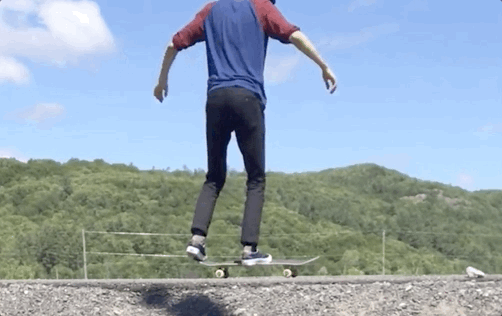
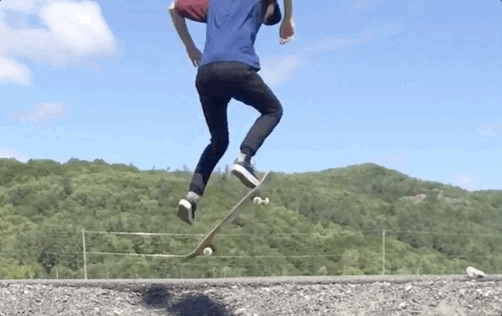

# First Attemps At An Ollie

This month (June 2020) I decided I would learn how to ollie on a skateboard. I've been comfortable 
cruising around on different boards for several years but have only learned simple tricks like a manual
and a caveman. I have a lot of free time during the pandemic and this is the hobby I've chosen to 
develop.

## How To Ollie

I've been using [this video](https://www.youtube.com/watch?v=7Wd5_VC5U0I&feature=youtu.be) to learn the trick.
After watching it many times this is how I would summarize how to do an ollie:

1. Place your back toe on the back tail of the board (the part that curves upward) and place your
   front foot somewhere in the middle of the board so that it feels comfortable
2. Crouch down and begin to jump
3. When your legs near extension, begin to raise your front foot and flick your back heel down
4. Continue raising your front foot and allow the board to become almost vertical
5. Push your front foot forward (allowing it to slide up the board) while raising your back leg
6. Land

## Breakdown Of An Almost Succesful Attempt

This section will breakdown one of the more succesful attemps that I caught on video during a 
practice session. First I will show the full attempt, then I will use slowed down versions
to break down what I did right and what I did wrong.

Here's the full version

   

It's far from perfect but I do manage to get the board a few inches in the air and land on it. Not bad 
for a few hours of practice!

### The Good

The following gif shows the first half of the jump where I successfully follow the first four steps 
of the previously defined list. My front foot raises just before my right ankle flicks down allowing 
the front of the board to rise. The board only makes it to about a 45 degree angle but I'll take what 
I can get.

   

### The Bad

The second half is where things don't go so well. Instead of pushing my front foot forward the gif
shows that I stomp it straight down. Pushing the front of the board straight down **does** make
the back of the board come up giving me some air. 

   

