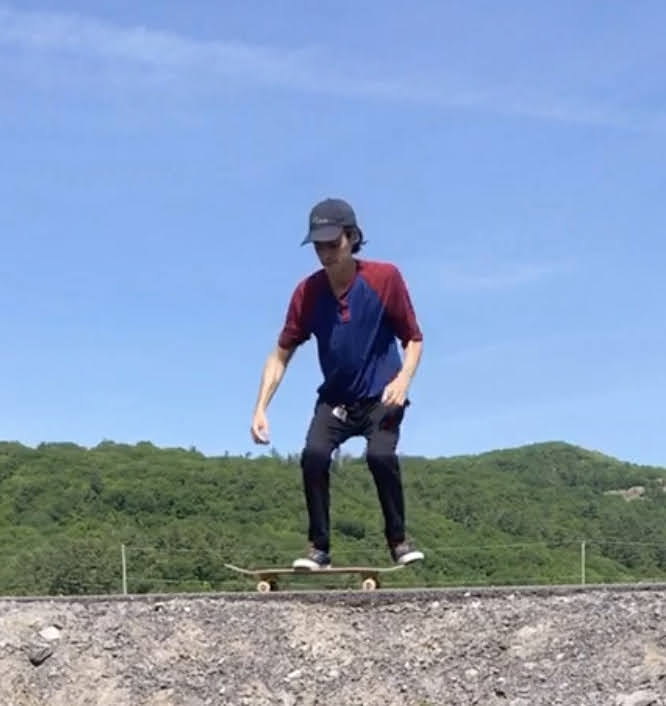

# Ollie Progress Update 1 (June 15, 2020)

Today was my first practice session since I analyzed one of my [first attemps](ollie-first-attempts.md). 
Jumping up and down over and over again for two and a half hours is incredibly tiring in the hot 
sun but I managed to get some good attemps on video.

Here is the best one. It's far from perfect but I do manage to get some decent air!

  

## The Good

Starting with the positive, I definitely reached a new record for how high I can get!

  

## The Bad

I think one of the biggest things holding me back is that I'm not crouching down far enough.
Compared to [the video](https://www.youtube.com/watch?v=7Wd5_VC5U0I&feature=youtu.be) I've been 
referencing, I could be crouching a lot lower. As you can see in the following table, David is
crouching so that his hands almost reach is feet whereas mine barely go past my knees. This 
is likely limiting the height of my jump and therefore the height of my ollie.

My Crouch                                 | Video Crouch
:----------------------------------------:|:-------------------------:
 | 
